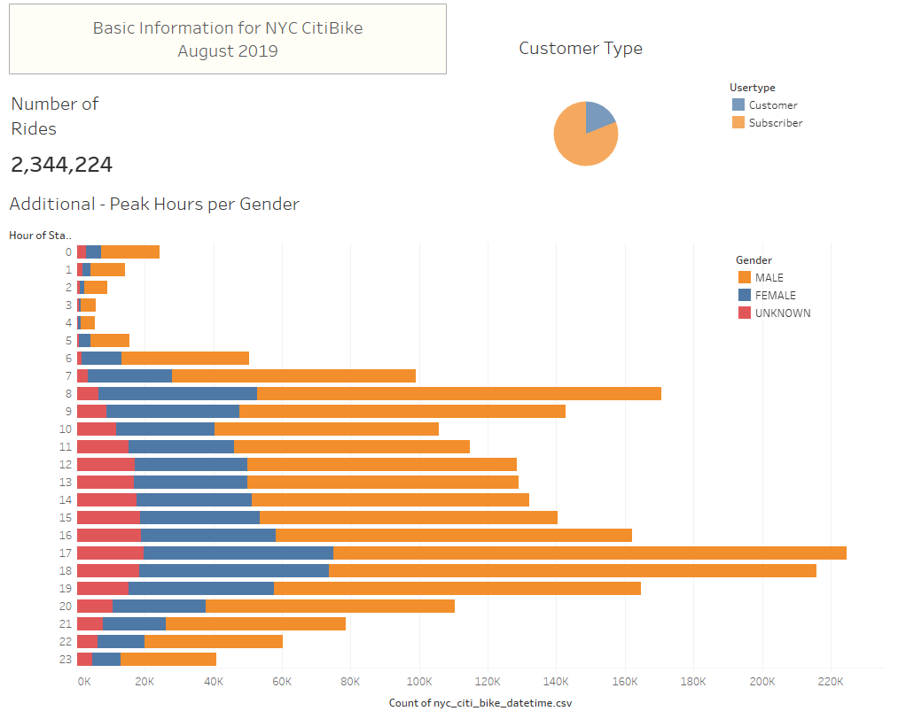
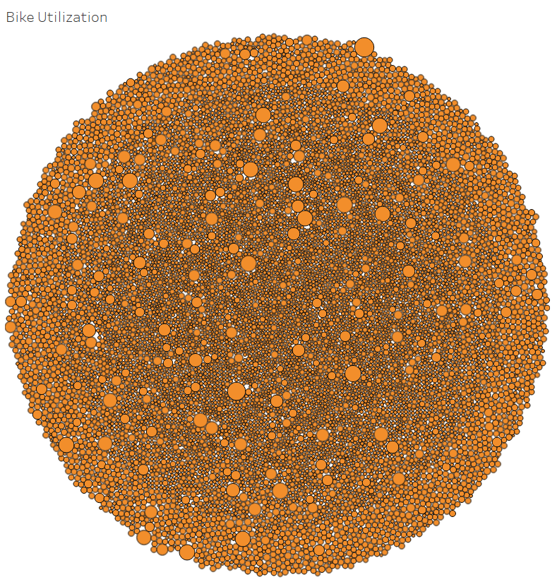
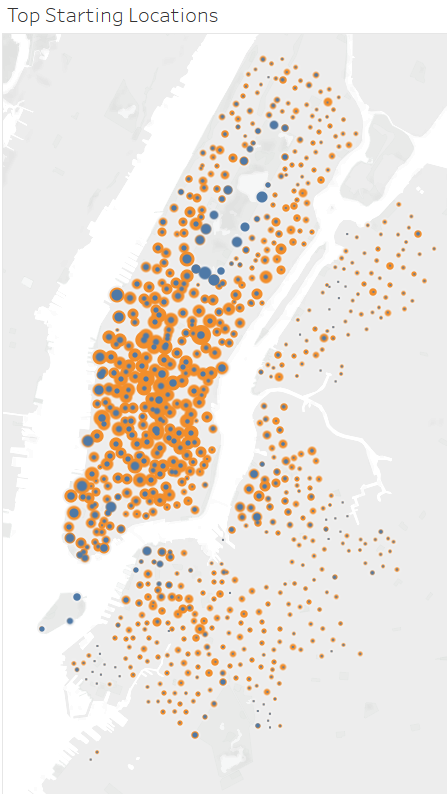
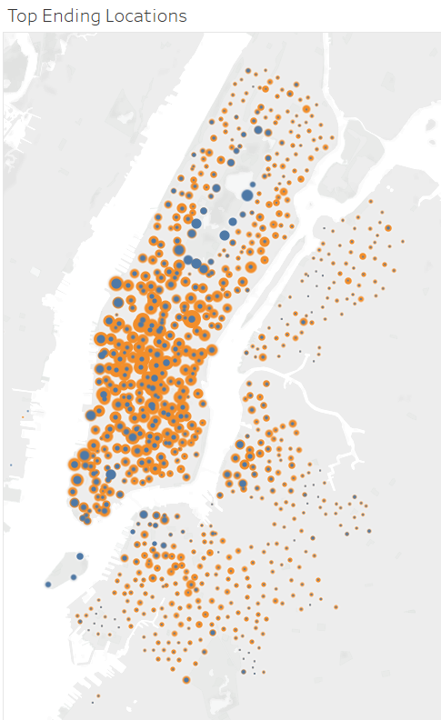

# NYC CitiBike
*Data Visualization with Tableau*

## Project Overview
### Purpose

For this project I am creating data visualization with Tableau for bike-sharing program in New Your City. The idea is to analyze the data, see the mechanic of the business and figure out how the bike-share business actually works in NYC. This is the first step of expanding the idea to other cities. With a strong and clear story, backed-up by data we can create a proposal on how the business could work in other cities as well.

**The Tableau story of the NYC Citi Bike can be found in the following link:** [NYC CitiBike Story](https://public.tableau.com/profile/andreja7092#!/vizhome/NYCCitiBikeStory_16026261346390/NYCCitiBike)

### Background 

Tableau is one of the most popular tools for data visualization in today’s professional world. It allows data visualization professionals to create data stories that are visually appealing and easy to understand for a non-technical audience. Moreover, Tableau provides the tool to create powerful analytic dashboards and tell a clear story that can be easily shared with others. Tableau can be simple, requiring little-to-no-coding, yet on the other hand can be quite complex, requiring some experience. For example convert datatypes or write custom code in so-called *calculated field*. For this project I am using:
-	Tableau to create visualizations, dashboard and story.
-	Pandas to convert integer to a datetime datatype.

## Resources 
-	Data Source:
    - [City Bike Trip History Data from August 2019](https://www.citibikenyc.com/system-data)
-	Software:
    - Tableau Public 2020.3
-	Languages & Environment:
    - Pandas, environment Python 3.7

## Result

**Basic Information**

The first page of the story is the dashboard that contains some basic information about the data set. The purpose of this page is to familiarize with the data and to introduce what kind of data we will be dealing in the further analysis. 

The page contains the following:
-	Information about the data set date: August 2019 in New York City 
-	Number of the total rides: 2,344,224
-	Customer type: we have two types of users – subscribers and customers
-	Peak hours of the selected month, divided by gender: we have three genders male, female and unknown, and we get a quick information about the users behavior what time of the day they use service the most.

**1. Checkout Times for Users**

The graph has number of checkout bikes on the y-axis and trip duration on the x-axis. X-axis is divided into hours (at the top) and minutes (at the bottom) for more detailed information about trip duration. From the graph we can see the most frequent checkout times are between 3 hours to 8 hours. 

**2. Check Out Time by Gender**

The graph shows number of checkout bikes on the y-axis and trip duration on the x-axis. X-axis is divided into hours (at the top) and minutes (at the bottom) for more detailed information about trip duration.  Tree different colors represent the classification of gender. Yellow represent male, blue represent female and red represent the unknown gender. From the graph we can see that checkout times for males is much higher than for female or unknown gender, especially between 1hour to 10hours checkout time duration. 

**3. Trips by Weekday per Hour**

The graph shows number of trips per hour and per weekday. The graph has hours on the y-axis and weekdays on the x-axis. The color indicates the number of the trips. Darker color indicates more trips, while lighter color indicates less trips. Form the graph we can see that the busiest times are in the morning hours on weekdays from 6am till 9am and in the evening hours on weekdays between 5 pm and 7 pm. On weekends (Saturday and Sunday) the busiest times are in the middle of the day approximately between 10 am and 6 pm.

**4. Trips by Gender (Weekday per Hour)**

The graph shows number of trips per hour and per weekday. The graph has hours on the y-axis and weekdays on the x axis. The color indicates the number of the trips. Darker color indicates more trips, while lighter color indicates less trips. Additionally, the graph is divided by gender (male, female and unknown). From the graph we can see that distribution of the checkout times for all genders is similar - the busiest times are in the morning hours on weekdays from 6am till 9am and in the evening hours on weekdays between 5 pm and 7 pm. On weekends (Saturday and Sunday) the busiest times are in the middle of the day approximately between 10 am and 6 pm. However, males have significant higher number of trips than female or unknown gender. 

**5. User Trips by Gender by Weekday**

The graph shows number of trips by weekday, by user type (subscribers and customers) and by gender. The graph has weekdays and user type on y-axis and gender on x-axis. Amongst subscribers’ males have the highest number of the trips especially on Thursdays and Fridays, followed by trips on Monday and Tuesdays. Females has similar distribution of the trips, with significant lower number of trips than males. Unknown gender has uniform distribution of the trips throughout the week. Looking at the customers’ data we can see significant less trips throughout all genders with slight increase amongst unknown gender on Saturdays and Sundays.

**6. Bike Utilization**

This graph displays all bikes and their accumulated trip utilization (datatype for the time used is used as integer for easier calculations). When hover over the bike id and time units are displayed for each bike. Looking at the graph we could group this data roughly into 4 groups: Small bubble approx. 200,000 time units, Medium-small bubble approx. 300,000 time units, Medium bubble approx. 1,000,000 time units and Large bubble approx. 2,000,000 time unit. From this visualization we can see how to classify bikes into groups for their maintenance, rotation and distribution. 

**7. Top Starting Locations & Top Ending Locations**

    

From those two graphs we can see the most popular starting and ending locations. Darker and larger bubbles represent locations with the highest number of trips, lighter and smaller bubbles represent lowest number of trips. From the graph we can see that the downtown area is much more popular than area around downtown, yet as much as important to provide good customer experience.

[maybe write how this data is important to and how we can use it…]

## Summary

The story of the NYC Citi Bike starts off with the basic information about the users and the trips. This data analysis contains data from August 2019, assuming that is one of the busiest times for using bikes in NYC. This is important because bike maintenance and customers that are not subscribers plays big role in this type of business. I want to focus on few components for this analysis:

-	Bike maintenance. As mentioned before bike maintenance plays big role in this type of the business. Base on the graph “Peak house per Gender” the least popular time is between 11pm and 5am. This is good time to do the maintenance. Additionally, graph Bike Utilization shows that we could group bike utilization in roughly 4 groups. Some bikes are used far more often then the other, so good planning, rotation bikes form popular station to less popular stations is crucial. 

-	Customers (non-subscribers). Customers are the most important part in the business. As we prepare our business, we should pay attention to more “unpredictable” customers – “walk-in”. In popular times for tourism we can expect more customers will use the service. To be ready for this surg, business should plan ahead with maintenance the bikes, stations, especially the popular ones and of course keep the balance that subscribers always have access to their routine and ensure good customer experience. 

-	Gender. From the most graphs we saw that usage of the bikes is disproportional amongst genders. With careful and mindful marketing approach we could target underrepresented groups and increase the business. 

-	Trip-duration. The most popular time duration checkout time is between 3-8 hours. This tells another story about the users.  Users checkout the bike for a single trip and return bike to the station (3 hour) or may rent the be bike until their return trip (8+ hours). We could address few things here. From revenue perspective is good that customer is willing to pay for the whole time, yet the utilization of the bikes may not be the most efficient. Business could set up more stations for users to return the bikes on the station for the time that they are not using the bikes. 

Additionally, I would suggest few things for further analysis with the given data set:
-	Trip duration of checkout times per user types. With this analysis we could see the trend of trip durations amongst user types.
-	Weekday and the trip duration. With this analysis we could see if the trend of the trip duration is similar or different on different days.
-	Additional color filter in Top Ending and Top Starting location to see which stations are more popular amongst subscribers and customers. 

